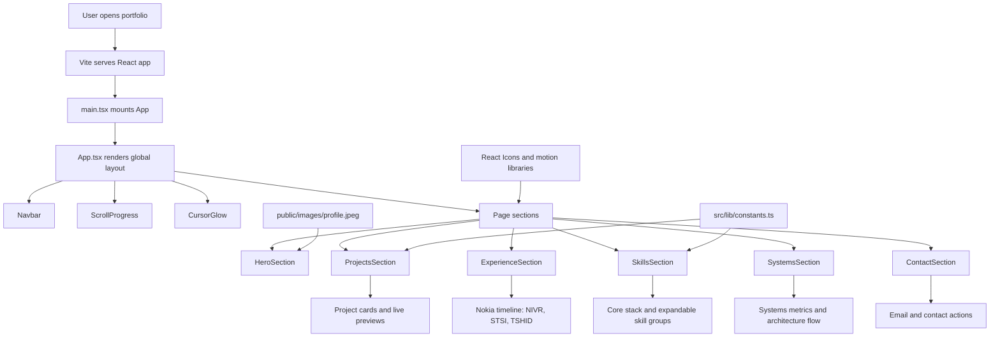

# Samaksh Rastogi Portfolio

A React, TypeScript, and Vite portfolio frontend focused on full-stack projects, Nokia professional experience, skills, systems impact, and contact details.

The application is built as a single-page portfolio. Most visible content is driven from structured data in `src/lib/constants.ts`, while larger page areas are implemented as independent section components under `src/sections`.

## Tech Stack

- React 19
- TypeScript
- Vite
- Tailwind CSS
- Framer Motion
- React Icons
- React Type Animation
- Three.js with `@react-three/fiber` and `@react-three/drei`

## Main Features

- Hero section with animated role titles, core tech stack chips, and impact highlights.
- Featured projects section backed by structured project data.
- Professional experience timeline for Nokia projects:
  - NIVR, Nokia Inventory Video Repository
  - STSI, Simplified Technical Support Interface
  - TSHID, Hot Issues Dashboard
- Skills section with a highlighted core stack and expandable skill groups.
- Systems and impact section with portfolio metrics and architecture thinking.
- Contact section focused on opportunities and role availability.

## System Flow



## Developer Architecture

### Entry Point

`src/main.tsx` mounts the React application into the root DOM node.

`src/App.tsx` owns the page-level layout. It renders global visual elements such as the background layers, navigation, cursor glow, scroll progress, and all portfolio sections in order.

### Data Layer

`src/lib/constants.ts` contains reusable portfolio data:

- `skills`: grouped skill categories shown in the Skills section.
- `projects`: featured project metadata shown in the Projects section.

Keeping these arrays centralized makes content updates easier and prevents the project and skill cards from becoming hardcoded across multiple components.

### Section Components

The portfolio is organized into dedicated page sections:

- `HeroSection.tsx`: introduction, animated positions, top tech stack, profile image, and primary calls to action.
- `ProjectsSection.tsx`: featured projects, project cards, live links, and source links.
- `ExperienceSection.tsx`: Nokia professional experience timeline with project dates, descriptions, tags, and tech stacks.
- `SkillsSection.tsx`: core stack row plus expandable skill categories.
- `SystemsSection.tsx`: system metrics, architecture flow, and engineering impact cards.
- `ContactSection.tsx`: contact copy and email actions.

### Shared Components

- `Navbar.tsx`: section navigation and active scroll behavior.
- `SectionWrapper.tsx`: consistent section spacing and background variants.
- `ScrollProgress.tsx`: top scroll progress indicator.
- `CursorGlow.tsx`: pointer-based ambient effect.
- `MagneticButton.tsx`: hover interaction wrapper for primary actions.
- `ThemeToggle.tsx`: theme control component.

## Content Model

### Projects

Project objects use this shape:

```ts
type Project = {
  id: string;
  title: string;
  description: string;
  date: string;
  tech: string[];
  live: string;
  github: string;
  image?: string;
  status?: string;
  refreshPreview?: boolean;
  position?: number;
};
```

`position` controls ordering. Lower numbers appear first.

### Skills

Skill groups use this shape:

```ts
type SkillGroup = {
  id: string;
  category: string;
  items: string[];
  position?: number;
};
```

The Skills section renders the first set of skills by default and expands long categories on demand.

## Local Development

Install dependencies:

```bash
npm install
```

Start the local dev server:

```bash
npm run dev
```

Build for production:

```bash
npm run build
```

Run ESLint:

```bash
npm run lint
```

Preview the production build:

```bash
npm run preview
```

## Project Structure

```text
frontend/
  public/
    images/
      profile.jpeg
  src/
    components/
      CursorGlow.tsx
      MagneticButton.tsx
      Navbar.tsx
      ScrollProgress.tsx
      SectionWrapper.tsx
      ThemeToggle.tsx
    lib/
      constants.ts
    sections/
      ContactSection.tsx
      ExperienceSection.tsx
      HeroSection.tsx
      ProjectsSection.tsx
      SkillsSection.tsx
      SystemsSection.tsx
    App.tsx
    index.css
    main.tsx
```

## Update Guide

### Add a Project

Add a new object to the `projects` array in `src/lib/constants.ts`. Set `position` to control where it appears.

### Add a Skill

Add the skill to the correct group in the `skills` array. If it needs a custom icon, add a matching key in `SkillsSection.tsx` inside `iconMap`.

### Update Experience

Edit the `experienceProjects` array in `src/sections/ExperienceSection.tsx`. Each entry includes:

- title
- subtitle
- phase
- date
- description
- tags
- tech stack

### Update Hero Messaging

Edit `src/sections/HeroSection.tsx` for:

- animated position titles
- hero summary
- top tech stack chips
- achievement chips
- profile image path

## Build Notes

The production build runs TypeScript project build first, then Vite:

```bash
tsc -b && vite build
```

If the build reports a large chunk warning, it is not a compile failure. It means the JavaScript bundle is larger than Vite's default warning threshold. Future optimization options include code splitting the 3D/profile visual or lazy-loading heavier visual libraries.
